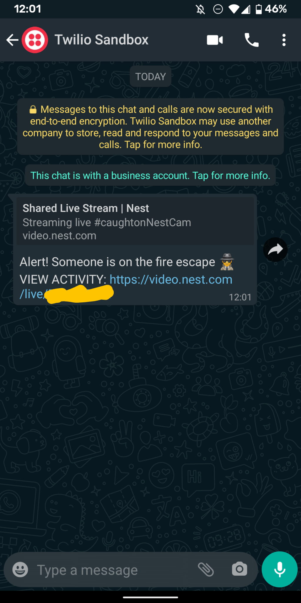

# Smart-Fire-Escape-Monitor
This project integrates TensorFlow Object Detection to analyze the security threat of objects to my apartment and notify me accordingly in real-time.

<p align="center">
  
   
   
</p>

## Introduction
The motivation of this project was to midigate my safety concerns in my apartment. Leading up to my bedroom I have a fire-escape which leads directly down to the gorund. It has always been a fear of mine that someone with malicious intentions might come up this fire escape. However, from time-to-time a stray cat will come up and visit me. I thought this project would be a good practice not only on my Tensorflow Object Detetion skills but also on my utilization of the REST API for getting data from the nest camera and sending Whatsapp messages to alert me.


## Getting Started
``` 
$ conda env create -f environmnet.yml
``


