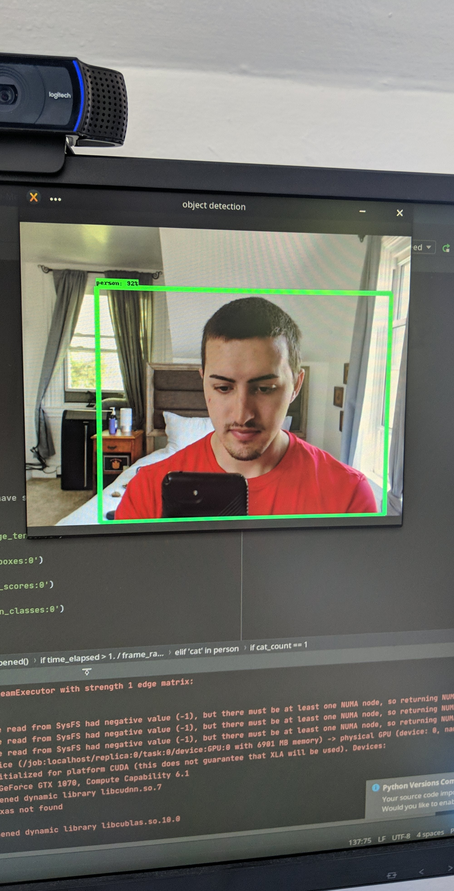

# Smart-Fire-Escape-Monitor
<p align="center">
  
   
   
</p>

## Introduction
The motivation of this project was to midigate my safety concerns in my apartment. Leading up to my bedroom I have a fire-escape which leads directly down to the gorund. It has always been a fear of mine that someone with malicious intentions might come up this fire escape. However, from time-to-time a stray cat will come up and visit me. I thought this project would be a good practice not only on my Tensorflow Object Detetion skills but also on my utilization of the REST API for getting data from the Nest camera and sending Whatsapp messages to alert me.

## Features
Using OpenCV the video input is piped into my python project. The video is then analyzed using the SSD Inception v2 Coco dataset. The classified video is then further analyzed based on the objects present. If a cat is present then a Whatsapp message is sent to me notifying me of this. From this message I can view the video feed from my Nest cam if I choose to. If a person is present then a Whatsapp message is sent to me alerting me of the predicted danger. From this message I can also view the video feed from my Nest cam.

## Getting Started
``` 
$ conda env create -f environmnet.yml
```

## Author
* Solomon Heisey
